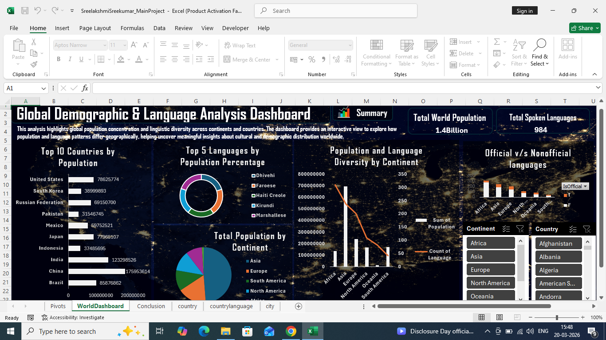

# Global Demographic & Language Analysis Dashboard (Excel)

This project presents an interactive Excel dashboard analyzing global population distribution and language diversity across countries and continents.

## Tools Used
- Microsoft Excel
- Pivot Tables
- Data Visualization (Charts, KPIs, Slicers)

## Key Features
- Top 10 countries by population
- Top 5 languages by population percentage
- Continent-wise population distribution
- Language diversity analysis across continents
- Comparison of official vs non-official languages
- Interactive filters for continent and country selection

## Dashboard Preview

## Key Insights
- Asia contributes the largest share of the global population
- Europe and Africa show higher language diversity relative to population size
- A small number of countries dominate global population distribution
- Several countries have a high number of non-official languages, indicating cultural diversity
- Language distribution varies significantly across continents
